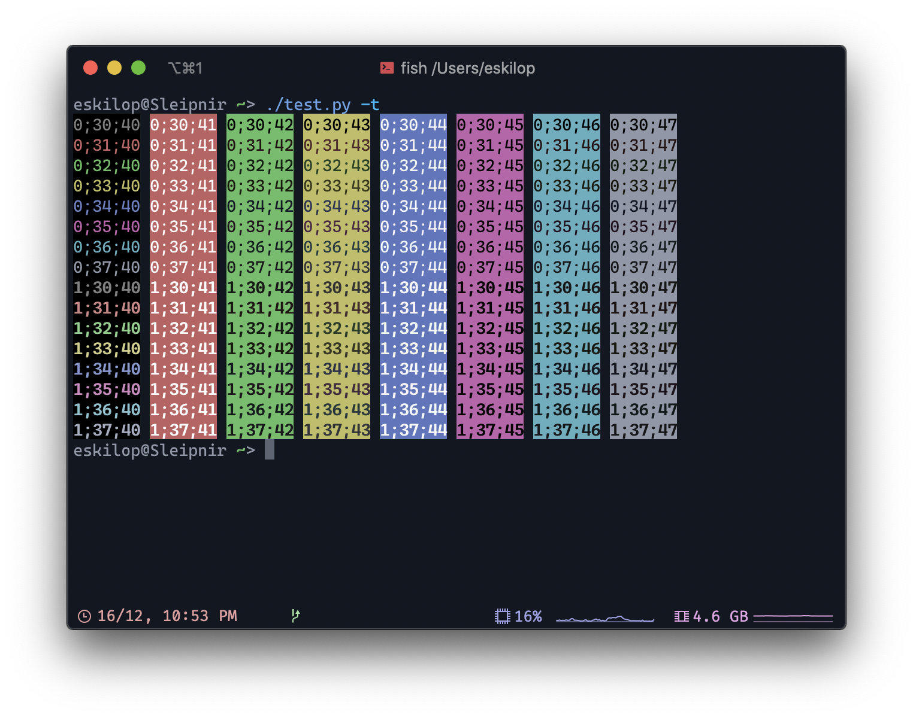

# NorthernLights for Terminals
My NorthernLights Theme, for various terminals.

# Installation
- Download the right profile (Right click, save as...):
  - [iTerm](https://raw.githubusercontent.com/NorthernLightsTheme/NorthernLightsTerminals/master/NorthernLights.itermcolors)
  - [Terminal.app](https://raw.githubusercontent.com/NorthernLightsTheme/NorthernLightsTerminals/master/NorthernLights.terminal)
 - [Konsole](https://raw.githubusercontent.com/NorthernLightsTheme/NorthernLightsTerminals/master/konsole.colorscheme)

## Terminal.app
- Open settings > Profiles
- Click the third button (lower right, on the left side of the screen) > Import
- Select the profile you downloaded earlier.

## iTerm
- Open iTerm preferences > Profiles > Colors > Color Presets... > Import...
- Select the profile you downloaded earlier.

## Alacritty
- Copy the contents from [alacritty.yml](https://raw.githubusercontent.com/NorthernLightsTheme/NorthernLightsTerminals/master/alacritty.yml)
- Paste in your config file (typically `~/.config/alacritty/alacritty.yml`)

## Konsole
- Copy the configuration file into `~/.local/share/konsole/`
