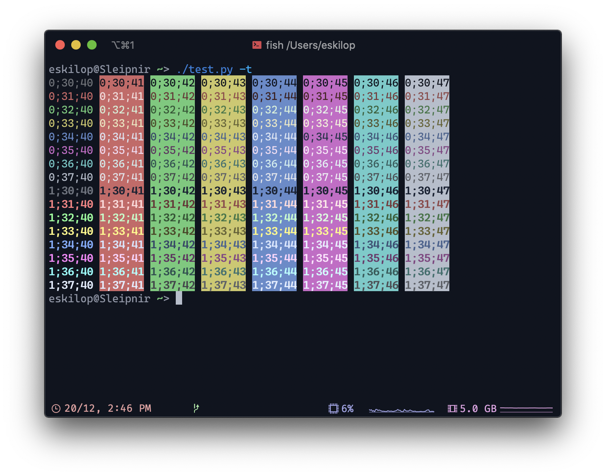

# NorthernLights for Terminals
My NorthernLights Theme, for various terminals.

# Installation
- Download the right profile (Right click, save as...):
  - [iTerm](https://raw.githubusercontent.com/eskilop/NorthernLights-iTerm/master/NorthernLights.itermcolors)
  - [Terminal.app](https://raw.githubusercontent.com/eskilop/NorthernLights-iTerm/master/NorthernLights.terminal)

## Terminal.app
- Open settings > Profiles
- Click the third button (lower right, on the left side of the screen) > Import
- Select the profile you downloaded earlier.

## iTerm
- Open iTerm preferences > Profiles > Colors > Color Presets... > Import...
- Select the profile you downloaded earlier.
